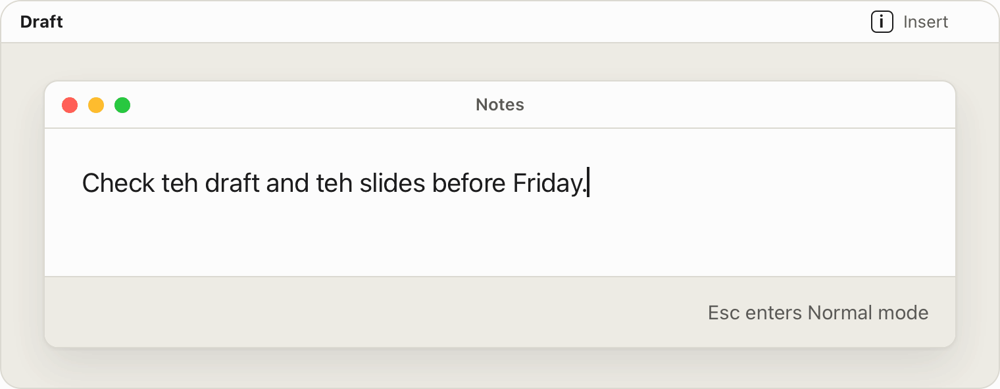

<p align="center">
  
</p>

<h1 align="center">uvim</h1>

<p align="center">
  <b>Vim's modal editing in the text fields of your Mac.</b><br>
  A menu-bar app for macOS 14 or later. Free software under the GNU GPL.
</p>

<p align="center">
  <a href="https://github.com/celve/uvim/releases/latest"><b>Download</b></a> ·
  <a href="https://uvim.app">Home page</a> ·
  <a href="#what-works">What works</a> ·
  <a href="#development">Development</a>
</p>

<p align="center">
  <picture>
    <source media="(prefers-color-scheme: dark)" srcset="docs/images/demo-dark.gif">
    
  </picture>
</p>

<p align="center">
  <sub><b>Fix every typo.</b> Each step is what uvim's engine does with these keys, in its simulation of a
  native Mac text field. Esc enters Normal mode once you choose it in the menu.
  The home page has <a href="https://uvim.app">more demos</a>.</sub>
</p>

uvim reads and edits the focused field through Accessibility, and takes the keys it needs with a keyboard
event tap. Type as usual, and press **⌃[** for Normal mode, or **Esc** if you choose it in the menu.

- **Vim's grammar, not only `hjkl`.** Operators with motions and word objects, counts, registers, marks,
  search, Visual mode and `.` ([What works](#what-works)).
- **Native apps, browsers and Electron apps.** Where a field takes no writes, uvim presses keys instead and
  checks the field after each step: when the field does not answer as planned, it beeps and stops rather than
  edit the wrong text. It also [learns](#browsers-and-electron-apps) what each kind of field supports.
- **Your shortcuts stay yours.** A field starts in Insert mode, apps keep every ⌘ and ⌥ combination, and
  terminals and code editors start Off.
- **Private.** No networking code of its own: a release's only traffic is the update check, which asks first
  ([Privacy](#privacy)).

## Install

1. Download the [latest release](https://github.com/celve/uvim/releases/latest), unzip it, and move `uvim.app`
   to `/Applications` before you open it for the first time: Sparkle, which updates uvim, cannot update a copy
   run from Downloads or from a disk image, and by default it does not say so.
2. Open uvim and allow **Input Monitoring** when macOS asks. uvim does not ask for **Accessibility**: choose
   **Accessibility: not granted** in its menu and switch uvim on there.
3. Quit uvim and open it again, since it creates its keyboard tap only at launch. The menu should now read
   `Input tap: running`, `Accessibility: granted` and `Input Monitoring: granted`.
4. To enter Normal mode with Esc, choose **Esc** under **Normal Mode Key** in the menu.

A release is signed with a Developer ID certificate and notarized by Apple. It [updates](#updates) itself: on
its second launch uvim asks whether to check once a day. You can also
[build uvim from source](#building-from-source).

To uninstall, switch **Start at Login** off, quit and delete the app, remove it from Accessibility and Input
Monitoring in System Settings → Privacy & Security, run `defaults delete io.github.celve.uvim`, and delete
`~/Library/Application Support/uvim`.

<details>
<summary><h3>Upgrading from mvim</h3></summary>

The app was named mvim through version 1.0.0. Its identifier changed with the name, to
`io.github.celve.uvim` from `io.github.celve.mvim`, or from `com.loom.mvim` in older builds from
source, and to macOS those are different apps: the permissions, the settings, the beliefs file and
the login item stay with the old one. mvim 1.0.0 offers uvim as an update and then fails to install
it, because Sparkle looks in an update for an app with mvim's file name or identifier. So move over
by hand, once. This prints the identifier of the mvim you have, the old identifier below:

```sh
defaults read /Applications/mvim.app/Contents/Info CFBundleIdentifier
```

1. In mvim, switch **Start at Login** off, and wait until its checkmark clears: it switches in the
   background.
2. Quit mvim. If the old identifier is `com.loom.mvim` and you run Vibe, quit Vibe too (step 7 says
   why).
3. Remove mvim from Accessibility and Input Monitoring in System Settings → Privacy & Security.
4. Carry the settings and the beliefs file over before you open uvim for the first time, with the
   old identifier in place of `io.github.celve.mvim`:

   ```sh
   defaults export io.github.celve.mvim - | defaults import io.github.celve.uvim -
   ditto ~/Library/Application\ Support/mvim ~/Library/Application\ Support/uvim
   ```

   Text recording does not carry over: its setting is now `recordText` ([Diagnostics](#diagnostics)).
5. Install uvim as above, or [build it from source](#building-from-source), and grant both
   permissions as on a first install. **Start at Login** can go back on.
6. Delete `mvim.app` and `~/Library/Application Support/mvim`, and run `defaults delete` with the old
   identifier.
7. If the old identifier was `com.loom.mvim` and you run Vibe, rebuild Vibe from a checkout whose
   `SynthTag.magic` is `0x4345_4C56`, as uvim's is ([Synthesized events](#synthesized-events)),
   before opening it again. A uvim and a Vibe with different tags each take the other's typing for
   yours, so Normal mode would run a dictated transcript as commands.

In a checkout cloned before the rename, `git remote set-url origin https://github.com/celve/uvim.git`
follows the repository to its new address, and `rm -rf mvim.xcodeproj .release/mvim.app` removes
what the old name's builds left.

</details>

<details>
<summary><h3>Building from source</h3></summary>

To build from source, you need Xcode 26 or later (the full app, not only its command-line tools),
[XcodeGen](https://github.com/yonaskolb/XcodeGen) 2.45.1 or later (`brew install xcodegen`), and an
**Apple Development** signing certificate, which Xcode → Settings → Accounts → Manage Certificates…
creates.

1. Clone this repository and find your certificate's full name, the quoted text this prints. macOS
   keeps uvim's permissions only while its signature stays the same, and an ad-hoc signature changes
   with every build ([Signing](#signing)).

   ```sh
   security find-identity -v -p codesigning
   ```

2. Build it under that name, as `make release` alone asks for the Developer ID certificate that
   releases carry. Then copy it to where it will live, since [Start at Login](#start-at-login)
   remembers the path:

   ```sh
   make release SIGN="Apple Development: Your Name (XXXXXXXXXX)"
   rm -rf /Applications/uvim.app && ditto .release/uvim.app /Applications/uvim.app
   open /Applications/uvim.app
   ```

3. Grant the permissions and open uvim again, as in steps 2 and 3 above.

To update a build from source, quit uvim, run `git pull --autostash` and the same `make release`,
and copy the app again; the permissions carry over while the same identity signs it.

</details>

## Using it

A field starts in Insert mode. Moving between the blocks of one document, as in Notion, keeps the mode you
were in.

**⌃[** enters Normal mode, leaves Visual mode and cancels a half-typed command. It is Control and the key to
the right of P, whatever the keyboard layout.

**Esc stays the app's** by default, for its own cancels and dialogs. Choose **Esc** under **Normal Mode Key**
and Esc does what ⌃[ does, except in Normal mode with nothing half-typed, where it still goes to the app:
press Esc twice to close a dialog, a popup or Spotlight from a field. ⌃[ keeps working either way.

The menu-bar icon shows the mode as a letter in a square:

| Icon | Meaning |
|---|---|
| Outlined **i** or **r** | Insert or Replace mode: keys type |
| Filled **n** or **v** | Normal or Visual mode: keys are commands |
| Dashed square | uvim is not working in a field |
| Slashed square | **Vim Mode** is off |
| **!** | Accessibility is not granted, or the input tap is not running |

Where uvim can set the selection, Normal mode also draws a block cursor. Nothing shows a half-typed command,
or a `/` search as you type it.

In Insert mode uvim takes only ⌃[, and Esc if you chose it. In Normal and Visual mode apps still keep every ⌘
and ⌥ combination, Esc unless you chose it, Home, End, Page Up and Page Down, the function keys, and every ⌃
combination but ⌃[, ⌃R and ⌃V, and ⌃F and ⌃B while
[the app's own page keys](#native-word-paragraph-and-page-keys) are on. So ⌃A, ⌃E and ⌃K work
as in any Mac text field, and a key uvim does not know beeps instead of typing.

The menu is uvim's whole interface:

- **Vim Mode** turns uvim off everywhere until you turn it back on or uvim starts again.
- **Normal Mode Key** chooses ⌃[ or Esc for every app.
- **Vim in _App_** chooses, per app:
  - **Auto**: uvim works in text fields, text areas and combo boxes, but never in password fields.
  - **Off**: uvim leaves the app alone. Terminals and code editors start Off: Terminal, iTerm2, kitty,
    Alacritty, WezTerm, Ghostty, Warp, Visual Studio Code, Cursor, Xcode, Zed, VimR, Neovide and the
    JetBrains IDEs.
  - **Force**: for apps that expose no text field to Accessibility. uvim drives the front window without
    reading it, with arrow keys and ⌘Z, ⌘X, ⌘C and ⌘V, and a click returns to Insert mode.
- **Capabilities in _App_** shows what uvim can do in the current field, starting with what it learned to
  switch off in fields like it, and lets you override it; a badge on it counts what is off here.
- The status rows report the input tap and both permissions; the permission rows open their System Settings
  panes.
- [**Start at Login**](#start-at-login) and, below it, **Open Beliefs File**, which opens the
  file that keeps your choices and what uvim has learned.

uvim also stands aside while macOS has Secure Event Input on, as it does in a password field.

## What works

A subset of Vim. In a field uvim can read and write, as in most native Mac apps:

| | |
|---|---|
| **Move** | `h` `j` `k` `l` and the arrow keys, `w` `W` `e` `E` `b` `B`, `0` `^` `$` `g_`, `gg` `G`, `+` `-` ⏎, `f` `F` `t` `T` `;` `,` |
| **Search** | `/` or `?`, the text, ⏎; then `n` `N`. Literal text, case-sensitive, wrapping around the end |
| **Marks** | `m` and a letter; then `'` or `` ` `` and the letter to jump back, in the same field, until its text is edited |
| **Operators** | `d` `c` `y` `g~` `gu` `gU` with a motion, `iw` `aw` `iW` `aW`, or doubled (`dd` `cc` `yy` `g~~` `guu` `gUU`), but not yet with `gg`, `g_` or a search as the motion |
| **Edit** | `x` `X` `s` `S` `r` `C` `D` `Y` `J` `gJ` `~` `p` `P` `.`, and `u` and ⌃R, which press the app's own ⌘Z and ⇧⌘Z |
| **Insert** | `i` `a` `I` `A` `o` `O` `gi` |
| **Visual** | `v`, motions or `iw` `aw`, then `d` `c` `y` `~` `u` `U` `>` `<`. A selection can end one character short of Vim's, and `V` and ⌃V select characters, not lines or blocks |
| **Counts** | Most commands take one. `gg` `G` `C` `D`, the Insert commands, `u` and ⌃R ignore it |
| **Registers** | `"a`–`"z` (`"A`–`"Z` append), `"0`–`"9`, `"-`, `"_`, `".`, `"/`, kept until uvim quits. `"+p` and `"*p` paste the Mac clipboard, but a yank does not copy to it |

These beep instead: `:` and `q`, after which the keys you type run as Normal-mode commands; `@`; `z`
commands; the operators `=` `!` `gq` `gw`; text objects other than words (`ip` `i(` `i"` `it` …); the
motions `ge` `%` `(` `)` `H` `M` `L` `*` `#` `[[` `]]`; and `g-` `g+` `&` `gR` `Q`. So do `{` `}` `gj`
`gk`, unless [the app's own keys](#native-word-paragraph-and-page-keys) are on.

## Browsers and Electron apps

Chromium browsers and Electron apps, such as Chrome, Dia and Linear, let uvim read a field, and some, such as
Linear in Dia, let it set the selection too, so uvim moves and selects there by writing it. Where a field
takes no writes, or uvim has learned that they fail, uvim runs the same Normal-mode commands by pressing keys
(arrows, ⌃A and ⌃E, ⌘↑ and ⌘↓) with no block cursor, and checks the field after each step: when the field
does not answer as planned, it beeps and stops rather than edit the wrong text.

**uvim learns.** When one of the field's writes, or one of the app's keys uvim relies on, fails its check
three commands in a row, uvim switches that capability off for fields like the one it failed in until the app
updates; the app's own word and paragraph keys go off after one failure. Some failures only stop the command:
a key landing elsewhere in Chromium's rich text, a word key doing nothing in web content, anything under
**Force**, and any capability you set yourself. **Capabilities** lists what was switched off first, under
**Learned for …** with the day it failed, and **Try Again** forgets it so uvim tries it afresh. **On …** and
**Off …** override what uvim detected or learned, for one field, fields like it, a site or the whole app, and
[a file you can edit](#the-beliefs-file) keeps those choices and what uvim learned.

What else differs there:

- `o` and `O` paste their new line, because ⏎ could send a message.
- `j` and `k` count the lines Linear shows: a list's markers, to-do boxes and a code block's language label
  are not lines, and a mention chip is one character on its paragraph's line.
- In a field uvim cannot read at all, and under **Force**, moves are approximate, deletes and yanks go
  through ⌘X and ⌘C so the clipboard is the register, and search, marks and Visual mode beep.
- Where each block of a page is a field of its own inside the page's, as in **Notion**, uvim reads that from
  the page: `j` and `k` press ↓ and ↑, so they move by the rows you see and from one block to the next, and
  the mode stays as you go.
- An input or a plain text area keeps uvim while a row of its popup list is highlighted, as in Linear's ⌘K
  menu, so pick the row from Insert mode: in Normal mode the arrow keys and ⏎ are Vim's motions. A rich-text
  editor loses uvim meanwhile, except an empty one, which is a known limit: there Normal mode takes the keys
  meant for that row until you press `i`.
- **App's word, paragraph & page keys**, off by default, hands `w` `e` `b` `iw` `{` `}` `gj` `gk` ⌃F ⌃B to
  [the app's own keys](#native-word-paragraph-and-page-keys).

[How uvim presses keys there](#native-keys) is under Development.

<details>
<summary><b>The full account</b></summary>

Chromium browsers and Electron apps, such as Chrome, Dia and Linear, let uvim read a field, and some,
such as Linear in Dia, let it set the selection too, so uvim moves and selects there by writing it.
Where a field takes no writes, or uvim has learned that they fail, uvim runs the same Normal-mode
commands by pressing keys (arrows, ⌃A and ⌃E, ⌘↑ and ⌘↓) with no block cursor, and checks the field
after each step: when the field does not answer as planned, it beeps and stops rather than edit the
wrong text. In these apps `o` and `O` paste their
new line, because ⏎ could send a message. Blank lines are lines there as in Vim, except in a document
of more than about 250 paragraphs, a list's markers, to-do boxes and a code block's language label are
not, and a mention chip is one character on its paragraph's line, so `j` and `k` count the lines Linear
shows, and columns start after a list item's `• ` or `1. `. In a field uvim cannot read at all, and
under **Force**, moves are
approximate, deletes and yanks go through ⌘X and ⌘C so the clipboard is the register, and
search, marks and Visual mode beep.

Some editors make each block of a page a field of its own inside one editable page, as **Notion**
does. uvim reads that from the page, in a browser or an Electron app, with no list of sites: such a
field names a bigger editable field around itself. There `j` and `k` press ↓ and ↑, so they move by
the rows you see and cross from block to block, `gg` and `G` press ⌘↑ and ⌘↓, the mode stays as the
caret changes block, and what needs the whole text, such as `J`, a search or `gi`, beeps. After Esc
in Notion selects a block, `j` and `k` move that selection. An editor whose blocks are separate
fields with nothing editable around them gives uvim nothing to read, so there turn **Text covers
whole document** and **New field starts a session** off for the site yourself. The Notion app also
comes with the block cursor off, since Notion shows its formatting toolbar over any selection; in a
browser the cursor is drawn until you turn **Draw block cursor** off for the site.

An input or a plain text area keeps uvim while a row of its popup list is highlighted, as in Linear's
⌘K menu or a search box's suggestions, though Chromium then calls that row, not the field, the focused
element. Pick the row from Insert mode: in Normal mode the arrow keys and ⏎ are Vim's motions. A
rich-text editor with anything in it still loses uvim while such a row is highlighted, because
nothing there tells uvim whether the editor has the focus. An empty one is a known limit: uvim cannot
tell it from an empty text area, so it keeps uvim, even if the page has moved the focus onto a row of
its list. uvim then stays in its mode, and in Normal mode it takes the keys meant for that row until
you press `i`.

uvim also learns. When one of the field's writes, or one of the app's keys uvim relies on, fails its
check (it lands wrong, or not within a quarter of a second) three commands in a row, uvim switches that
capability off for fields like the one it failed in until the app updates. A command where it works
starts the count over, and so does relaunching uvim; the app's own word and paragraph keys go off after
one failure. **Capabilities** then lists it first, under
**Learned for …** with the day it failed, and **Try Again** forgets it so uvim tries it afresh.
Some failures only stop the command: a key landing elsewhere in Chromium's rich text, a word key
doing nothing in web content, anything under **Force**, and any capability you set yourself. uvim
also learns how a field counts caret positions: where the field's reads stop agreeing with it, it
stops trusting the caret (**Read caret** shows under **Learned for …** as Off) and treats the field
as one it cannot read, and a capability switched off while uvim misread a field comes back once it
counts that field anew, reading **Trying again here** in the menu.
**On …** and **Off …** override what uvim detected or learned, for one field, fields like it, a site
or the whole app. Those choices and what uvim learned are kept in a file you can edit as well:
**Open Beliefs File** opens it (see [The beliefs file](#the-beliefs-file)). **App's word,
paragraph & page keys**, off by default, hands `w` `e` `b` `iw` `{` `}` `gj` `gk` ⌃F ⌃B to the
app's own keys: see [Native word, paragraph and page keys](#native-word-paragraph-and-page-keys).

</details>

## Privacy

uvim needs **Accessibility**, to read and edit the focused field and to post keys, and **Input Monitoring**,
for its keyboard tap. The tap sees every key you press, but uvim acts only on keys typed into a field it is
working in.

- **Network.** uvim has no microphone, keychain or networking code of its own; a release build's only traffic
  is [Sparkle](#updates)'s update check, which asks first.
- **What it records.** Its settings, its beliefs file and its log name the apps and websites you use. The log
  also records the Normal-mode commands you type, but never the text you insert or a command's operand, count
  or register (a unit test holds it to that), unless you turn on
  [text recording](#diagnostics); if uvim ever mistook the mode, some of your words could
  reach it as commands.
- **Clipboard.** uvim pastes through the clipboard into fields it cannot write, and restores the clipboard
  afterwards; in fields it cannot read, cut and copy use the clipboard itself.

## Reporting a bug

Open an [issue](https://github.com/celve/uvim/issues) with your macOS version, uvim's version from Finder's
Get Info (or the output of `git rev-parse --short HEAD` for a build from source), the app (and the site, in a
browser), the keys you typed, what happened and what you expected, and a screenshot of the **Capabilities**
menu. A command that fails is always logged, so attach the last hour of uvim's log, after reading it, since it
names apps and sites:

```sh
log show --predicate 'subsystem == "io.github.celve.uvim"' --last 1h --info --debug > uvim.log
```

Never post a `log collect` archive: it holds your whole system log. To log the commands that succeed as well,
see [Diagnostics](#diagnostics).

## Development

uvim builds with Xcode 26 or later and [XcodeGen](https://github.com/yonaskolb/XcodeGen), and `make test` runs
the engine's tests with no Xcode project and no permissions. Each section below opens in place;
[Building from source](#building-from-source) is under Install.

**Build and release**

<details>
<summary><h3>Make targets</h3></summary>

The Xcode project is generated from [`project.yml`](project.yml) by XcodeGen and built with
`xcodebuild`. `uvim.xcodeproj` is git-ignored: edit `project.yml`, then regenerate.

| Command          | Description                                                          |
| ---------------- | -------------------------------------------------------------------- |
| `make gen`       | Generate `uvim.xcodeproj` from `project.yml`                         |
| `make build`     | Generate, then build Debug to `build/Build/Products/Debug/uvim.app`  |
| `make run`       | Build, then launch the Debug `uvim.app`                              |
| `make test`      | Run the pure engine's tests: no Xcode project, no permissions        |
| `make test-pasteboard` | Run the pasteboard loan's tests on a private pasteboard: no permissions |
| `make test-beliefs` | Run the beliefs file's tests in a temporary directory: no permissions |
| `make release`   | Build Release, copy it to `.release/uvim.app`                        |
| `make dist`      | `release`, then notarize it and stage its update in `dist/`          |
| `make publish`   | `release`, then notarize it, stage its update and release it on GitHub |
| `make clean`     | Remove `build/`, `dist/` and the `.xcodeproj`                        |
| `make distclean` | `clean`, plus remove `.release/`                                     |

`make release` launches and installs nothing. `make clean` leaves `.release/` alone (see
[Start at login](#start-at-login)); `make distclean` removes it too. The Release build number is the
commit count, which is how [updates](#updates) are ordered. `make dist` and `make publish` need the
GitHub CLI, `gh`, and the certificate and credentials of
[Publishing an update](#publishing-an-update).

By hand:

```sh
xcodegen generate
xcodebuild -project uvim.xcodeproj -scheme uvim -configuration Debug \
  -derivedDataPath build build
```

</details>

<details>
<summary><h3>Project layout</h3></summary>

```
uvim/
├── project.yml                 # XcodeGen spec — 2 framework targets + the app
├── Makefile                    # gen / build / run / test / release / dist / publish / clean / …
├── Info.plist                  # Sparkle's feed and key, merged into the generated plist
├── uvim.entitlements           # intentionally empty — uvim runs non-sandboxed
├── LICENSE                     # GPL-3.0
├── docs/
│   ├── images/                 # the README's icon and demo
│   └── release-notes/          # <version>.md: what that version's release notes open with
├── scripts/
│   └── sparkle-release.sh      # notarizes, stages and publishes updates (make dist / publish)
├── Sources/
│   ├── Core/                   # Core framework — what the engine stands on: InputHub
│   │                           #   (one shared CGEventTap), KeyEvent/Mods, field reads
│   │                           #   (AX, MarkerText, WebAreaWalk), Synth (posted keys), Prefs,
│   │                           #   capability config (Surface, CapabilityConfig,
│   │                           #   CapabilitySeeds), SecureInput, LoginItem, Log.
│   │                           #   NO Keychain in uvim's copy.
│   ├── Vim/                    # Vim framework (→ Core) — modal editing:
│   │   ├── Key,Model,Raw,      #   pure engine (no AppKit/AX; `make test` compiles this):
│   │   │   Logical,Physical,   #   the keystroke gate, vocabulary, parsing + key
│   │   │   State,Text,Sim,     #   assembly, planners, state + reducer, text math,
│   │   │   Learn,Field         #   simulated host, the learner's beliefs, the field's
│   │   │                       #   reads, snapshot and capabilities
│   │   └── Runtime/            #   tap routing, AX execution, Controller, Diag, PasteboardLoan,
│   │                           #   Beliefs (the beliefs file)
│   └── App/                    # uvim app — composition root: UvimApp (the menu-bar
│                               #   menu, the whole UI), its AppModel, and Updater (Sparkle)
├── Tests/
│   ├── VimEngineTests/         # `make test`: the engine driven through Sim, as preconditions
│   ├── PasteboardTests/        # `make test-pasteboard`: the paste's loan on a private pasteboard
│   └── BeliefsTests/           # `make test-beliefs`: the beliefs file in a temporary directory
└── Resources/
    ├── AppIcon.icon/           # App icon: an Icon Composer document, edited in Icon Composer
    └── Assets.xcassets         # Accent color (still empty)
```

</details>

<details>
<summary><h3>Modules</h3></summary>

`uvim (app) → Vim → Core`, one-way and compiler-enforced; the app also imports Core directly. Vim's
pure engine (everything under `Sources/Vim` except `Runtime/`) has no AppKit/AX dependency and is
unit-tested standalone via `make test`, with the pure Core files the Makefile lists. Only the app
links [Sparkle](https://sparkle-project.org), pinned to an exact version in `project.yml`.

</details>

<details>
<summary><h3>Signing</h3></summary>

`project.yml` signs the two configurations differently, both under the team it names:

- **Debug** (`make build`, `make run`) signs with a stable **Apple Development** identity
  (`CODE_SIGN_STYLE: Automatic`) so the Accessibility / Input Monitoring grants persist across
  rebuilds — an ad-hoc signature would change every build and macOS would revoke the grants each
  time.
- **Release** (`make release`, `make dist`, `make publish`) signs with the team's **Developer ID
  Application** certificate, which is what Apple's notary service takes: under the hardened runtime,
  with a secure timestamp, and without `get-task-allow`, the entitlement that lets other processes
  attach a debugger. That holds for the app, both frameworks and Sparkle's helpers. The style is
  `Manual` because Xcode's automatic signing cannot use Developer ID.

[`uvim.entitlements`](uvim.entitlements) stays empty under the hardened runtime too: Accessibility and
Input Monitoring are grants, not entitlements. The two configurations share one bundle identifier and
differ in signature, so going from a Debug build to a Release one on the same Mac, or back, costs the
grants each time.

To build under a different team, change `DEVELOPMENT_TEAM` in `project.yml`: every `make build` and
`make release` regenerates the Xcode project from it, so a team picked in Xcode does not stick. Keep
that change out of pull requests.

Without those certificates, `SIGN` signs one `make build`, `make run` or `make release` another way,
leaving `project.yml` alone. `make run SIGN=-` signs ad-hoc: it builds anywhere, but macOS revokes
the grants at every build. `SIGN="<name>"` signs with another code-signing identity in the keychain,
such as your own Apple Development certificate or a self-signed one, named in full as
`security find-identity -v -p codesigning` prints it; switching to or from it costs the grants once,
and they persist across its builds. A `SIGN` build is not hardened: the hardened runtime loads an
app's frameworks only when they carry its team, and an ad-hoc or self-signed signature has none.
`make dist` and `make publish` refuse `SIGN`, since only `project.yml`'s Developer ID signature can be
notarized, and installs keep their grants only while updates keep it.

</details>

<details>
<summary><h3>Start at login</h3></summary>

The menu's **Start at Login** toggle registers uvim with `SMAppService.mainApp`, the API that
replaced `SMLoginItemSetEnabled`. The system owns the bit — nothing is mirrored into `Prefs`.
Three consequences worth knowing:

- **It needs a real signature.** `SMAppService` fails with `kSMErrorInvalidSignature` on a bundle
  that is not properly code-signed, so the toggle needs a build made with an Apple Development
  or Developer ID identity — see [Signing](#signing).
- **Registration records the bundle's path.** Move the app afterwards and the item still points at
  the old location; `make clean` strands one registered from `build/`, and `make distclean` or
  deleting the clone one registered from `.release/`. Register from wherever uvim will actually
  live, such as `/Applications`.
- **A denial in System Settings is one-way from uvim's side.** Switching the item off under System
  Settings → General → Login Items leaves the status at `requiresApproval` — registered but denied —
  and `register()` cannot clear it. The menu shows the toggle unchecked and grows an **Approve uvim
  in Login Items Settings** row.

A login-launched uvim keeps its Accessibility and Input Monitoring grants: same bundle, same
signature.

</details>

<details>
<summary><h3>Updates</h3></summary>

Every build embeds [Sparkle](https://sparkle-project.org), but a build has update items only when
its Info.plist names both a feed and a public key. `project.yml` gives both to Release builds
alone, so a Debug build never updates. Release builds update themselves from this repository's
GitHub releases: the feed is the `appcast.xml` attached to the latest one.

- **Sparkle asks first.** On uvim's second launch it asks whether to check once a day, and
  whether to install what it finds without asking. **Check for Updates Automatically** in the
  menu changes the first answer; the checkbox in the update window changes the second.
- **Check for Updates…** checks now. When a daily check finds an update later than right after
  launch, the item reads **Update to uvim X…** instead: a menu-bar app has no window to bring
  forward, so Sparkle would otherwise open its window behind your work.
- **Grants survive an update** because TCC holds them against the app's designated requirement,
  and `make publish` refuses a build that fails the current release's — see below.
- **An update is notarized like a download.** Sparkle removes the quarantine mark from what it
  installs, so Gatekeeper never checks an update; `make dist` and `make publish` check it instead,
  and stage nothing else.
- **Sparkle updates only a copy it can replace.** One run from Downloads or from a disk image it
  cannot, and by default it does not say so: keep uvim in `/Applications` ([Install](#install)).
- **What goes out:** a request to github.com for the feed, and the download when you install.
  Sparkle's anonymous system profiling stays off.

</details>

<details>
<summary><h3>Publishing an update</h3></summary>

Once, on the Mac you will publish from:

1. Check at [developer.apple.com](https://developer.apple.com/account) → Membership that the Apple
   Developer Program membership of the team in `project.yml` is active. Without it there is no
   Developer ID certificate and no notarizing.
2. Create the team's **Developer ID Application** certificate: Xcode → Settings → Accounts →
   Manage Certificates… → **+**. Only the team's Account Holder can, and its private key stays in
   this Mac's keychain.
3. Store credentials for Apple's notary service in the keychain, under a profile name you choose:

   ```sh
   xcrun notarytool store-credentials uvim-notary --apple-id <your Apple ID> --team-id <your team ID>
   ```

   It asks for an app-specific password: [account.apple.com](https://account.apple.com) → Sign-In
   and Security → App-Specific Passwords makes one. `make dist` and `make publish` take the
   profile's name from `NOTARY_PROFILE`.
4. Get the Sparkle key into the login keychain. `SPARKLE_PUBLIC_KEY` in `project.yml` already holds
   its public half, so on another Mac import the private half: run `make release`, which resolves
   Sparkle, then `build/SourcePackages/artifacts/sparkle/Sparkle/bin/generate_keys -f <backup>`. A
   fork makes a pair of its own with `generate_keys` alone and commits the public key it prints.
5. Back the private key up — `generate_keys -x <file>`, then store the file somewhere safe.
   Installed copies check every update against that key, and `make publish` releases under no other.
6. `gh auth login`: the release is created with the GitHub CLI.

For each release, from a clean checkout of `main` on that Mac:

1. Bump `MARKETING_VERSION` in `project.yml` and merge it.
2. `NOTARY_PROFILE=uvim-notary make dist` builds the app, sends it to the notary service and waits
   for the answer, which Apple says typically comes within an hour, staples the ticket to
   `.release/uvim.app`, and stages `dist/uvim-<version>.zip`, its notes (GitHub's, from the merged
   pull requests, below `docs/release-notes/<version>.md` when that file exists) and `appcast.xml`
   without publishing anything. Allow the keychain prompts the first time.
3. `NOTARY_PROFILE=uvim-notary make publish` does all of that again, then creates release
   `v<version>` holding the zip and the appcast. Installed copies find it at their next check.

Both notarize the app as a zip, staple the ticket to the app, which a zip cannot carry, and zip it
again, so Sparkle signs the archive that ships. `make dist` and `make publish` both stop when:

- `gh` is missing, `NOTARY_PROFILE` is not set, `SUPublicEDKey` is empty, or the feed is not a GitHub
  latest-release asset;
- the app is not signed with a Developer ID Application certificate, which a `SIGN` build and a
  Debug build are not;
- GitHub can write no release notes for `HEAD` because it is not pushed;
- the notary service does not answer that it accepted the app: a rejection prints the service's log,
  which names each file it objects to;
- the ticket cannot be stapled, or the app unpacked from the finished zip lacks its ticket or does
  not pass Gatekeeper as a notarized Developer ID app: the zip reaches `dist/` only after that;
- the appcast item came out unsigned because the key is not the one `SUPublicEDKey` names.

`make publish` also refuses to release when:

- the app does not satisfy the designated requirement of the latest release's app — TCC holds
  Accessibility and Input Monitoring against that requirement, so every install would lose both. A
  Developer ID requirement names the team, not the certificate, so any Developer ID Application
  certificate of the same team satisfies it; for a deliberate change, such as moving to another
  team or a new identifier, `SPARKLE_NEW_IDENTITY=1 make publish` publishes anyway. Under a new
  file name and identifier, installs are still offered the update and cannot install it, since
  Sparkle looks in an update for the installed app's file name or identifier;
- `SUPublicEDKey` is not the latest release's. Installs check an update against the key they shipped
  with, and Sparkle takes a new key only from an update that keeps the Developer ID signature, never
  both changed at once; the script holds the key fixed, with no override. On a new Mac, import the
  original key with `generate_keys -f <backup>`; never paste a freshly generated one into
  `project.yml`;
- the tree has uncommitted changes, `HEAD` is not on `main`, `v<version>` exists, or the build
  number does not exceed the one the latest release offers, which installs would ignore;
- GitHub cannot answer any of those questions: a failed read refuses rather than guesses.

The first release skips the checks against the latest release.

`SPARKLE_KEY_FILE=<file>` signs with a key file instead of the keychain.

The zip holds the app with its ticket stapled, so Gatekeeper needs no network to check a copy
downloaded in a browser, and macOS opens it after its one confirmation for an app from the Internet.

</details>

**How it works**

<details>
<summary><h3>Diagnostics</h3></summary>

uvim records one line per **command decision** to `os_log`, under subsystem
`io.github.celve.uvim`. The unit is the decision, not the keystroke: what a reader wants back is
*"the engine believed X about this field, and X was false"*.

```sh
log show --predicate 'subsystem == "io.github.celve.uvim"' --last 1h --info --debug
log collect --last 2h --output uvim.logarchive     # the whole system log: share it privately
```

A command that did **not** fully succeed logs at `.default` and is persisted to disk for
free, surviving the quit a stranded user is about to perform. A clean command logs at
`.debug`, which is off until asked for:

```sh
sudo log config --subsystem io.github.celve.uvim --mode "level:debug,persist:debug"
sudo log config --subsystem io.github.celve.uvim --mode "level:default"    # off again — it is sticky
```

The renderers live on the engine types themselves, under a `// MARK: - Recorder` banner in
each type's file; `grep -rn '// MARK: - Recorder' Sources` is the index.

Six categories: `bind` (a field became vim's, with its whole capability resolution),
`cmd` (the anchor event), `settle` (a prediction the field did not meet, and what it
answered instead), `learn` (the evidence a command gave, a [belief](#learned-beliefs) that
changed, or the reason nothing was learned), `gate` (an
element that did not become a binding, and a web field's walk to its site) and `system` (the
tap or the login item failing). Every engine line carries `e<epoch>.c<seq>` — the binding
and the command — so `grep -E 'e12\b'` is the whole join. A bind line is `e12 …` and a
command line `e12.c47 …`; the word boundary catches both and keeps `e120` out.

Reading a `cmd` line, `steps=` is the ordered, payload-free plan, one character per step:

```
W setSelection   R replaceSelection   P press (P3 = three times)   T typeText
X clipboardCut   Y clipboardCopy      V clipboardInsert            G captureSelectedText
! settle         ? softSettle         C commit                     B bell
```

Order is the diagnostic — a `!` directly after a counted arrow `P` is a hard settle verifying
a blind keypress, which can never name the capability it failed, so it rings without teaching
the learner anything. A `!` after a native key names that key, and a failure blames it
(`fail=lineStartKey`) when a caret key left a selection, when the field still reads as it did
before the key although the key had somewhere to go, or when the key landed somewhere else. In
Chromium's rich text a landing somewhere else aborts without learning. Where a key's lane exempts a
failure from blame, a `learn` line says so: `evidence q=lineStartKey neutral why=paragraph-lines
seen=settle@1` (a line key off target in Chromium's rich text), `why=empty-paragraph` (a key from a
caret in an empty paragraph uvim could not give a line) or `why=web-content` (a word or paragraph key that stayed put in web
content).

Before an edit deletes or types over a selection, it checks the selected text: `ciw` is
`W!!R!CCC` with AX selection writes and `P2P5!!P?CCC` without, where the second `!` waits for
`AXSelectedText` to equal the text the plan selected from `AXValue`, not counting the U+FFFC
Chromium writes into it for each icon or other element with no text. A misread caret puts keys
and exact writes alike on other text while every offset reads back as planned. A failed check
presses ← to drop that selection, leaves uvim in Normal mode, and tells the
[offsets belief](#learned-beliefs) that its answer does not fit. Its `settle` line adds `text=(N)`,
a length and never the text, on both sides (the text itself only with text recording on); a
`FAIL` whose `sel` and `len` agree failed on the text.

`abort@N` names the step that ended the run, and the `C`s behind it did **not** all die with
it: a commit carrying residency still lands (`VimEffect.survivesAbort`), which is why an
aborted line can read `ok=0` and `mode=normal→insert` together.

A Chromium rich-text field (a contenteditable in Chrome, Dia or an Electron app; its bind
line says `chromium=1 offsets=textContent/…`) names its selection in text content: `AXValue`
without the `\n` Chromium generates where a paragraph starts. uvim plans in `AXValue` offsets and
converts at the field's edge, so a `settle` line's `want` and `got` are the field's own offsets,
behind the planner's by the paragraph breaks before them. Where one field offset is both a
paragraph's end and the next one's start, `edge=end` or `edge=start` says which the settle waited
for. `AXValue` leaves out an empty paragraph that sits between two others; uvim finds those in the
accessibility tree and plans with each as a line of its own, while a settle's `len` stays
`AXValue`'s, and `empty=N` on a `cmd` line is how many lines the plan had that `AXValue` lacks.
The reverse holds for the text `AXValue` gives that no caret reaches, such as a list marker, a
to-do's checkbox or a mention chip past its first character: the plan leaves it out, so the field's
offsets run ahead of the plan's by what it left out before them, and `folded=N` is how many units of
`AXValue` it took.

A web field finds its site by walking up to the page that contains it. When the walk names no
site, the field keys at the app rung alongside the app's own chrome, and a `gate` line says
why:

```
e12 surface origin=nil web=1 role=AXTextArea stop=orphan@9 axerror=-25204 ms=151
```

`stop=` is where the walk ended and `@` the element it stopped at, 0 being the field itself:
`noURL` (the page exposed no `AXURL`), `hostless` (its URL names no site; `scheme=` says which,
such as `file`), `window` or `application` (no page above the field at all), `orphan` (no
parent to follow; `axerror=` is the read's `AXError`, `-25204` when the app did not answer in
time or at all, `nil` when it answered with no parent), `hopCap` (the element cap reached
without a page), `budget` (the walk's time budget ran out). For those last two, `@` is
the first element the walk did not read. A walk that found its site logs `stop=site@N` at
`.debug`.

A bind line's `caps=` gives each capability a code, `+` or `-`, and where the answer came from:
`p` read from the field, `s` a shipped default, `u` your choice, `l` learned. A field in web
content can be one block of a bigger document, as each block of a Notion page is: it then names
another editable field as its outermost one (`AXHighestEditableAncestor`), and its bind line says
`enclosed=1`. `wholeDocument` and `fieldIsSession` resolve off for it, `WD-p FS-p`, unless a
default or your choice answers first: the Notion app, which ships with defaults, reads
`WD-s FS-s enclosed=1`. Focus moving between two fields that name the same outermost one, or
between a field and the one it names, binds as `sameDocument` and keeps the mode. A native field,
and a web field with nothing editable around it, names none.

**Text is not recorded**, and that is a unit test rather than a convention. `keys=` shows
what you typed only where it is provably free of variable, data-bearing input — no operand,
no register, no digit; otherwise it shows the command's shape and a length. (`ciw` is
user-supplied too; what makes it safe is that it comes from a finite grammar.) `d/needle<CR>`
becomes `op(delete,search)…(12)`, `3dd` becomes `op(delete,line)…(3)`, and even `0` becomes
`motion(lineStart)…(1)`, because the digit test scans the string being written rather than
the parse — which is lossy and drops a count outright when the command is still incomplete.

The rule is not "syntax is safe, content is not". It is that when uvim's mode tracking is
wrong — the bug this exists to find — you believe you are typing and every keystroke parses
as a Normal-mode command, so an operand or a count *is* a letter of your prose. `4111…w` is
a card number with a `w` on the end. The opt-in for recording content, which the menu does
not offer and every `bind` line announces while it is on:

```sh
defaults write io.github.celve.uvim recordText -bool YES
defaults delete io.github.celve.uvim recordText
```

**Both edges need a relaunch.** The flag is read once per process, deliberately — re-reading
it per line would put a `UserDefaults` lookup on the command path — so `defaults delete`
does not stop a uvim that is already running.

</details>

<details>
<summary><h3>Native keys</h3></summary>

When a field can be read but not written, uvim moves by line and document with the standard
Cocoa bindings instead of counting arrow presses: ⌃A/⌃E to the start and end of the caret's
paragraph, which is uvim's line, ⇧⌃A/⇧⌃E to select there, and ⌘↑/⌘↓ (⇧ to select) for the
document. `dd` is ⌃A, ⇧⌃E, ⇧→; `j` is ⌃E, → and then the column counted on the new line; `0`,
`$`, `gg`, `G`, `D`, `C`, `cc`, `yy`, `o`, `O`, `J` and linewise puts follow the same pattern.
`x` and `X` still select one character and check it before deleting, because ⌦ and ⌫ would
delete first and join lines at a line end. Where a field is written but a write cannot land a line's
start or end alone, as beside Linear's list markers and chips, uvim presses ⌃A or ⌃E instead, and a
selection it wrote reaches a line's end by ⇧⌃E where no chip is in the way.

Where uvim still counts arrows, it takes the way with fewer presses. `j` and `k` count the column from
the nearer end of the new line: `j` adds a ⌃E to start from its end, and `k`'s last ← already lands
there. A move within a line goes by ⌃A or ⌃E and arrows back when that is fewer keys than counting
from the caret, a selection from the caret by ⇧⌃A or ⇧⌃E and ⇧ arrows back, and a selection that ends
at the caret by ⇧← from it. Each of these is an optional route: counting from the caret reaches the same
place without it. So the first time a route's settle fails, uvim plans without that route in fields like
that one and counts again, until uvim is relaunched or the app updates. The failed settle names the
route in its `want` (`route=line-start`, `route=line-end` or `route=select-back`), and the key itself
is not blamed. Arrows, ⌃A and ⌃E are posted with no pause between key down and key up; every other key
keeps 2 ms.

In Linear, → or ↓ from the last line of a list, a code block or a quote stops once before another of
the three that follows it directly, and so does ↑ coming back; next to a paragraph or a heading there is
no stop. uvim marks the first line after each stop, so `j`, `w`, a counted `$` and the like press through
it: ⇧→ →, or → → into a to-do, which ⇧→ will not extend into. Two quotes side by side show nothing in
the text, so in a ProseMirror editor uvim reads the document's blocks whenever the text has more than one
line, and again when a block changes kind, and marks a stop only between blocks that carry Linear's own
classes: any other editor's quote or list gets no stop it did not get before. A table or a collapsible
section has the stop too and is not marked, nor is one between blocks inside a quote.

Each key is a row in the Capabilities menu — **Line start key (⌃A)**, **Line end key (⌃E)**,
**Document start key (⌘↑)**, **Document end key (⌘↓)** — claimed for every field whose text
and caret uvim can read. A key that lands anywhere but where it
should, including a caret key that leaves a selection (as a select-all binding would) or a key that does
nothing where it had somewhere to go, is learned off for that surface after three such misses in a row,
like a write that lies, and uvim counts arrows there again; **Try Again** in the menu lets it try the key afresh. In Chromium's rich
text a key that lands somewhere else only aborts the command, because one paragraph can be several
`AXValue` lines there (a mention chip) and a working key lands off the model's line; its `learn` line
says `why=paragraph-lines`, and you can turn such a key off from the menu.

Chromium's rich text (Dia, Chrome, Electron apps such as Linear) reports the caret without the
paragraph breaks before it; uvim reads it through text markers and puts the breaks back,
and where that fails the caret is unknown and the command goes blind. Which fields count this
way is a [belief](#learned-beliefs), checked on every snapshot. Keys are pressed
even where a command has nothing to select or `j`/`k` stays on its line, so a settle still checks
the caret the command starts from. An empty paragraph can be missing from `AXValue`, with a caret
in it reading as the end of the line above, so uvim looks for these in the accessibility tree once
per text and gives each a line. Where it cannot, in a field of more than about 250 blocks
or when a read fails, a key pressed from a caret whose marker sits on an empty paragraph is not
blamed for seeming to do nothing. In such a field a yank within one line takes its register from
the text the field selected. A list item's marker (`•`, `1.`) is a line of its own in Linear's
`AXValue`, and so is each icon, checkbox or heading menu that is a block, and the language label above
a code block's code; no caret stands on any of them, so uvim leaves them out of its lines. The label of
a code block inside a list item or a quote stays a line, and `j` or `k` across it beeps. A page's own
list (`<li>`) starts each item's line with
its marker and a space, which no caret stands in either, so uvim leaves those out too. A mention
chip is a line of its own in Linear's `AXValue` too, though it sits inside its paragraph, and the
caret crosses it in one step: uvim gives it its paragraph's line back and counts it as one
character, whose register text is the chip's label. uvim tells markers
and chips from text in the accessibility tree, once per text; where it cannot, in a field of more
than about a hundred list items and chips or when a read fails, they stay lines and `j` or `k` into
one beeps. Edits across list items run without checking the length, since a list renumbers and
items gain or lose their markers, and nothing types over a chip, since typed text cannot rebuild
one. A chip that ends its paragraph is followed by a `<br>` the caret reads as already past, and
beside a chip Linear gives the caret an `AXValue` line of its own for as long as it stays there, so
in a document with chips the settles do not check the length. Where uvim can set the selection, it
never sets the caret at a chip's start, after which the next arrow does nothing; it sets it at the
chip's end and presses ←.

A register pasted where the field takes no AX insertion borrows the pasteboard. uvim saves every
item in every type it holds, puts the text up for one ⌘V (marked `org.nspasteboard.TransientType`,
so clipboard histories that honour it skip it), and puts the rest back once a settle sees the caret
land after the paste. Nothing else says when the app has read it, so a paste no caret confirms
stays up for a second: one where uvim cannot read the field, or one carrying a newline in Chromium
rich text, whose settles check the length alone, as `o` and `O` below do. Your own ⌘V,
and a paste of `+`, `*` or a blind cut's register, gets your contents back first; if the app has
not read uvim's paste by then, that paste gets your contents too. A copy or cut made meanwhile is
newer and is kept.

`o` and `O` paste their newline in web content: typed, it makes no paragraph in Chromium's rich
text, and ⏎ would send a chat message. Chromium leaves the new empty paragraph out of `AXValue`
until it holds text, so the settles after it do not check the length. In a field where uvim found
empty paragraphs, an edit that empties a line or types into an empty one changes which of them
`AXValue` shows, so the settles after it check neither the length nor the paragraph side.

</details>

<details>
<summary><h3>Learned beliefs</h3></summary>

uvim learns three kinds of answer about each kind of field — every field of one role on one site,
or in one app natively — and keeps them in the [beliefs file](#the-beliefs-file):

- **Writes** (`writeSelection`, `insertText`) and **native keys**: the probe claims them, and three
  settle failures in a row blamed on one set it off for that kind of field until the app updates. A
  pass in between starts the count over, as do a new offsets answer and a new app version, and the
  count lasts only while uvim runs. The app's word and paragraph keys (`wordKeys`, `paragraphKeys`)
  still go off after one.
- **Offsets**: how the field counts caret and selection offsets. `value` is `AXValue`'s count,
  `textContent` is Chromium's without the paragraph breaks it generates (the text-marker path),
  and `untrusted` withholds the caret, so commands take the blind lane (`ciw` is ⌥← ⇧⌥→ ⌘X
  there, and Visual mode rings). A Chromium field with children starts at `textContent` and any
  other field at `value`; a field with no children (a `<textarea>`, an `<input>`) has no generated
  breaks, so it always counts as `AXValue` does and teaches nothing. Every snapshot compares the
  plain `AXSelectedTextRange` with the text markers, and a selection's `AXSelectedText` with what
  each answer predicts. One observation moves the answer toward `textContent` or `untrusted`, on
  the snapshot it was made on; evidence for `value` moves it back only when the web engine changed
  (an Electron app's framework, else the app), and otherwise to `untrusted`. Under `value` the
  markers are read only where they could tell something, a newline at or before the plain caret,
  and a binding stops after three such reads say nothing.

A write or key answer records the offsets answer it was judged under and holds only while that
answer does: a demotion made while uvim misread the field's offsets reopens once the offsets answer
changes. Demotions from before beliefs carry over as judged under `value`.

Each piece of evidence is one `learn` line, `evidence q=<question> <outcome> why=<reason> seen=<where>`:
the outcome is `supports`, `refutes` or `neutral`, and `seen` is `snapshot` or `settle@N`, the plan
step. A failed settle's line is logged; passes and snapshot reads only at debug level. A struck
write says why: `unanswered`, `length`, `moved` (the selection read back elsewhere) or `edge` (the
offsets held but not the paragraph side). A struck key says `unmoved`, `left-selection`, `too-long` or
`off-target`, and the `commit` line that sets it off repeats the reason; a failure short of the third
logs `strike <n>/3 q=<question> why=<reason> rung=<rung>` instead.

The bind line shows the read model as `offsets=<answer>/<source>`, where the source is `start`
(the rule above), `learned`, `user` or `plain` (no children), followed by one `belief` line per
stored answer that touched the field, with its provenance and whether it is `in-force`, `reopened`,
`stale` (another engine's), `not-this-field` (a field with no children) or only `dates-engine`. In
the menu, **Capabilities** opens on what a belief switched off in the field, a demotion or **Read
caret** while it is `untrusted`, with the day and until when it holds, and on verdicts reopened in
this field, which read **Trying again here** and are not counted in the badge. **Try Again**, or
**Forget** for a reopened verdict, removes those beliefs and makes no choice. A learned `value` or
`textContent` only shows under **Read caret**: forgetting it would restart the field at an answer
its reads already moved it off. Choosing On or Off for a row retires what fields like this one
learned about it.

</details>

<details>
<summary><h3>The beliefs file</h3></summary>

`~/Library/Application Support/uvim/beliefs.json` keeps the choices made with **On …** and **Off …**
and the [learned beliefs](#learned-beliefs). It is JSON for you to read and edit, and **Open Beliefs
File** in the menu opens it:

```json
{
  "beliefs" : [
    {
      "answer" : "broken",
      "appVersion" : "153.0.6943.98",
      "judgedUnder" : "textContent",
      "provenance" : {
        "build" : "1.0.0 (812)",
        "learnedAt" : "2026-09-28T07:00:00Z",
        "tag" : "e3.c7"
      },
      "question" : "insertText",
      "rung" : "com.google.Chrome|linear.app|role:AXTextArea"
    }
  ],
  "overrides" : {
    "com.tinyspeck.slackmacgap" : {
      "nativeMotions" : "on"
    }
  },
  "schema" : 3
}
```

- `overrides` maps a rung, then a capability, to `on` or `off`, as the menu's On and Off write them.
  A rung is `<bundle ID>` for an app, `<bundle ID>|<site>` for a site in it, `…|role:<role>` for
  fields like one (natively `<bundle ID>|role:<role>`) and `…|id:<identifier>` for one field; the
  bind line's `rung=` prints a field's role rung.
- The capabilities, by menu row: `readText`, `readLength`, `readCaret`, `readSelectedText` (the
  Read rows), `writeSelection` (Set selection), `insertText` (Replace text), `drawCursor`,
  `wholeDocument`, `fieldIsSession` (New field starts a session), `lineStartKey`, `lineEndKey`,
  `documentStartKey`, `documentEndKey`, `nativeMotions` (App's word, paragraph & page keys),
  `wordKeys` and `paragraphKeys`.
- Each of `beliefs` is one learned answer. `question` is a write (`writeSelection`, `insertText`), a
  key (`lineStartKey`, `lineEndKey`, `documentStartKey`, `documentEndKey`, `wordKeys`,
  `paragraphKeys`) or `offsets`, and `answer` is `broken` for a write or key, or `value`,
  `textContent` or `untrusted` for `offsets`. A write or key answer holds only at `appVersion`, and
  only while the field's offsets answer is `judgedUnder` (`value` when absent). An offsets answer
  holds only at `engineVersion`, an Electron app's framework version, else at `appVersion`, and not
  while `anchor` is true. `provenance` (uvim's build, when, and by which command) and `tally` (the
  evidence counted) are for reading; an entry needs `provenance`, even as `{}`.

uvim rereads the file whenever it binds a field, so an edit applies when you next focus one. An
override you write lasts, as one chosen in the menu does, and beats a belief. A belief you write is
treated as learned: evidence can move an offsets answer, and an app update reopens a verdict. uvim
writes the file for the menu and for what it learns, but only over the version it read: an edit you
save in between is read back, and the change is made to it instead.

A file uvim cannot use is never written over: bad JSON, a missing key, another `schema`, an answer
its question cannot take, or an override other than `on` or `off`. uvim goes on applying the last
version that read, across relaunches too: the menu shows its choices, and the **Open Beliefs File**
row reads **Open Beliefs File — unreadable, last good version in use**. Each bind logs a
`beliefs-file` line in `learn` with the
reason, and neither lessons nor menu choices are saved until the file reads again. A question or
capability name uvim does not know is kept and ignored. Builds before the file kept overrides and
beliefs in the `capabilityOverrides` and `fieldBeliefs` defaults, which move to the file on first
launch and are dropped once a file reads. To forget one lesson, choose **Try Again** in its row, or
**Forget** for one on trial; to forget everything uvim learned, empty `beliefs`. Deleting the file
drops your choices as well:

```sh
rm ~/Library/Application\ Support/uvim/beliefs.json
```

</details>

<details>
<summary><h3>Native word, paragraph and page keys</h3></summary>

Off by default. **Capabilities in _App_ › App's word, paragraph & page keys** turns it on for one
field, fields like it, a site or the whole app. With it on, uvim presses the app's own keys
instead of counting arrows or ringing, and the app decides where they land:

| Vim | Keys |
|---|---|
| `w` `e` / `b` | ⌥→ / ⌥← |
| `iw` (`ciw` `diw` `yiw` `viw`) | ⌥→ ⌥← to the word's start, then ⌥→ ⇧⌥← over it, then ⌘X or ⌘C |
| `dw` `de` `cw` `ce` `yw` / `db` `cb` `yb` | ⇧⌥→ / ⇧⌥←, then ⌘X or ⌘C. From a word's edge, and in scripts written without spaces (Chinese, Japanese, Thai, Lao, Myanmar, Khmer), ⌥→ and ⌥← go out and back first |
| `{` `}` | ⌥↑ / ⌥↓ |
| `gj` `gk` | ↓ / ↑ |
| `j` `k` | ↓ / ↑, only where ⌃E/⌃A are demoted and uvim cannot land them on a line |
| `^F` `^B` | ⌥PgDn / ⌥PgUp. Without the option, ⌃F and ⌃B stay the app's |

- **Where it applies.** Words switch only in fields uvim can read but not select in, such as
  Chromium and Electron editors, and `iw` also in fields it cannot read. A field that sets its
  selection exactly keeps vim's words; the paragraph, row and page keys work in every field.
- **`j` and `k`** keep moving by line wherever uvim can land them on one: exact writes, or the
  ⌃E/⌃A hops in a field it reads but cannot select in. Only where those keys are demoted do they
  move by screen row.
- **What changes.** The semantics are the app's, not vim's:
  - words skip runs of punctuation and split Chinese and Japanese by dictionary;
  - ⌥→ stops at a word's end, so `w` lands where `e` does, and `dw` leaves the blank after the word;
  - ⌥↑ and ⌥↓ go to a paragraph's start and end, not to blank lines;
  - `ciw` on a blank selects the word before it, and rings where no word ends there.
- **What stays vim's.** `aw`, counted `iw`, `W` `B` `E` `ge`, and `{` `}` `gj` `^F` as operator
  targets or in Visual mode are unchanged.
- **Checks.** Where uvim can read the caret, each landing is checked against the caret the key
  started from. A word selection must be exactly what ⌥← and ⌥→ delimited or, mid-word, what the
  text says is left of the word; where neither can be known, as inside `foo,bar`, the command
  rings. If a key leaves the field unmoved when it should have moved, or selects more than that,
  it is demoted on that surface: **Word keys (⌥← ⌥→)** or **Paragraph keys (⌥↑ ⌥↓)** then shows
  under **Learned for …**. In web content, where reads cannot tell a key that did nothing, only a
  move that leaves a selection behind is demoted. Words go back to counting and paragraphs to
  ringing until you choose Try Again or override it, or the app updates.

</details>

<details>
<summary><h3>Synthesized events</h3></summary>

uvim tags every event it posts with `SynthTag.magic` (`0x4345_4C56`, in `Sources/Core/Synth.swift`),
and its tap passes tagged events through before any handler runs. **The magic is a cross-app ABI:**
Vibe, the author's dictation app, tags its typing with the same value, so Normal mode never runs a
transcript as commands. Never change the magic in one app without the other.

</details>

## License

Copyright © 2026 Linyu Wu

uvim is free software: you can redistribute it and/or modify it under the terms of the GNU General
Public License as published by the Free Software Foundation, either version 3 of the License, or (at
your option) any later version. It is distributed WITHOUT ANY WARRANTY; see [LICENSE](LICENSE) for
the full terms.

Builds embed [Sparkle](https://sparkle-project.org), which carries its own MIT license.
The icon's letter is the u of [Nunito](https://github.com/googlefonts/nunito) Bold, a font under the SIL Open Font
License.
